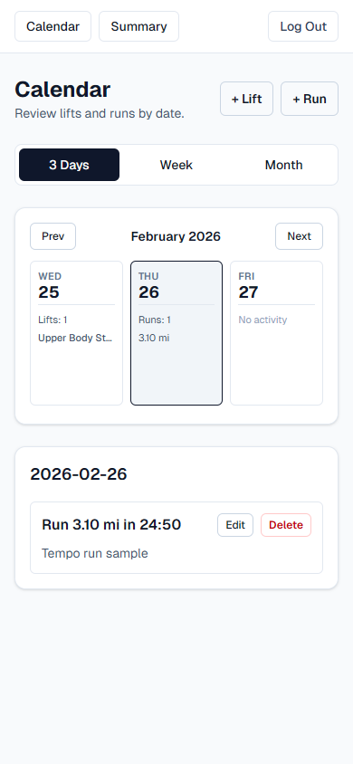
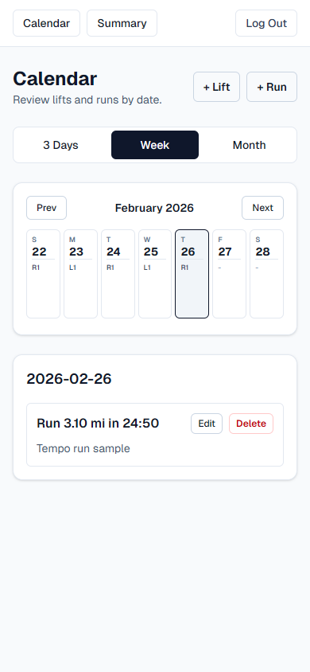
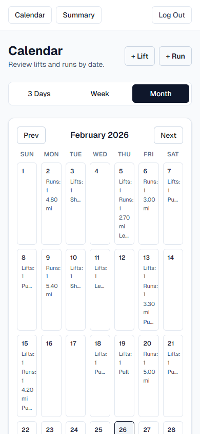
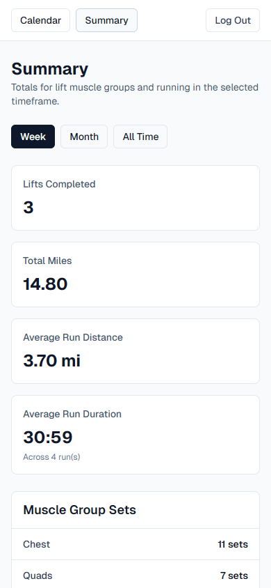

# Activity Tracker

Activity Tracker is a Next.js app for logging lifts and runs with strict per-user data isolation, account verification, and calendar-first review.

## Mobile Screenshots

Captured at a mobile viewport size of `390x844`.

| 3-Day Calendar | Week Calendar |
| --- | --- |
|  |  |

| Month Calendar | Summary |
| --- | --- |
|  |  |

## What The App Does

- Supports account auth with:
  - Email/password sign up and login
  - Email verification and resend verification link
  - Forgot/reset password by email token
  - Optional Google OAuth sign-in/sign-up
- Tracks lift sessions with:
  - Date, title, notes
  - Multiple exercise rows per session
  - Sets/reps/weight per row
  - Reusable exercise and muscle-group suggestions
- Tracks run sessions with:
  - Date, distance, duration, notes
- Provides calendar workflow:
  - Desktop month grid
  - Mobile `3d`, `week`, and `month` views
  - Selected-day details with edit/delete actions
- Provides summary dashboard ranges:
  - `week`, `month`, `all`
- Supports installable PWA + offline navigation fallback

## Tech Stack

- Next.js 16 (App Router) + React 19 + TypeScript strict mode
- Prisma ORM + PostgreSQL
- Tailwind CSS 4
- Zod (server-side form parsing)
- bcryptjs for password hashing

## Architecture At A Glance

- Routing and UI: `src/app/**`, `src/components/**`
- Business logic and infra: `src/lib/**`
- Persistence: `prisma/schema.prisma` + `prisma/migrations/**`

Flow summary:

1. Public auth routes validate input and call server actions/DB.
2. Session cookie (`activity_session`) is signed with `APP_SESSION_SECRET`.
3. Protected routes require a verified user via `requireCurrentUser()`.
4. Lift/run actions parse `FormData` with shared parsers, write via Prisma, then `revalidatePath("/")`.
5. Calendar and summary pages query scoped data by `userId`.

## Route Map

Public routes:

- `/login`: email/password login, Google CTA when configured
- `/signup`: account creation + verification email
- `/forgot-password`: reset-link request
- `/reset-password`: token-based password update
- `/verify-email`: verification token landing
- `/auth/google`: starts OAuth redirect
- `/auth/google/callback`: OAuth callback + account link/provision
- `/offline`: offline fallback page
- `/unlock`: legacy redirect to `/login`

Protected routes:

- `/`: calendar and selected-day details
- `/summary`: totals and averages
- `/lifts/new`, `/lifts/[id]/edit`: lift create/edit
- `/runs/new`, `/runs/[id]/edit`: run create/edit

## Data Model Summary

Core entities:

- `User`: auth identity (`email`, `passwordHash`, optional `googleSubject`, `emailVerifiedAt`)
- `Exercise`: reusable exercise names scoped to `userId`
- `MuscleGroup`: reusable muscle group names scoped to `userId`
- `LiftSession`: parent lift record (date/title/notes) scoped to `userId`
- `LiftEntry`: exercise rows under a lift session
- `LiftEntryMuscleGroup`: join table between lift entries and muscle groups
- `RunSession`: run record scoped to `userId`
- `EmailVerificationToken`, `PasswordResetToken`: hashed, expiring auth-email tokens

All workout-domain tables are user-scoped; queries and mutations should always include ownership constraints.

## Validation And Formatting Rules

- Date format: `YYYY-MM-DD` strings across UI + DB.
- Lift weight input:
  - accepted pattern: whole or one decimal place (e.g. `135`, `135.5`)
  - stored as integer tenths (`weightTenths`)
- Run distance input:
  - accepted pattern: whole or up to two decimals (e.g. `3`, `3.10`)
  - stored as integer hundredths (`distanceHundredths`)
- Run duration input:
  - accepted: `mm:ss` or `hh:mm:ss`
  - stored as integer seconds (`durationSeconds`)

Shared parsing lives in `src/lib/forms.ts`, and shared formatting helpers live in `src/lib/format.ts`.

## Time Zone Behavior

- App resolves request time zone from:
  1. `activity_tracker_tz` cookie
  2. request headers (`x-time-zone`, `x-vercel-ip-timezone`)
  3. server-local fallback
- Used for "today" defaults in create pages and range calculations.
- Client component `TimeZoneCookieSync` keeps cookie aligned with browser zone and refreshes protected pages when it changes.

## PWA / Offline

- Manifest route: `src/app/manifest.ts`
- Registration: `src/components/pwa-register.tsx` (production only)
- Service worker: `public/sw.js`
- Offline fallback page: `/offline`

Service worker behavior:

- Pre-caches offline page, manifest, and icons.
- Uses network-first for navigations, with offline fallback on failure.
- Uses cache-first with network fill for static assets.

## Requirements

- Node.js 20+
- PostgreSQL database
- Resend API key for verification/reset emails
- Optional Google OAuth credentials

## Local Setup

1. Install dependencies:

```bash
npm install
```

2. Create env file:

```bash
cp .env.example .env
```

PowerShell:

```powershell
Copy-Item .env.example .env
```

3. Configure env values in `.env`:

- `DATABASE_URL`
- `APP_SESSION_SECRET` (long random secret)
- `APP_BASE_URL` (local: `http://localhost:3000`)
- `RESEND_API_KEY`
- `EMAIL_FROM`
- `GOOGLE_CLIENT_ID` (optional)
- `GOOGLE_CLIENT_SECRET` (optional)

4. Apply migrations:

```bash
npm run prisma:migrate
```

5. Start dev server:

```bash
npm run dev
```

6. Open `http://localhost:3000/signup`.

## Environment Variables

Required:

- `DATABASE_URL`
- `APP_SESSION_SECRET`
- `APP_BASE_URL`
- `RESEND_API_KEY`
- `EMAIL_FROM`

Optional:

- `GOOGLE_CLIENT_ID`
- `GOOGLE_CLIENT_SECRET`

Notes:

- Google button appears only when both Google env vars are set.
- Base URL resolution falls back to `VERCEL_BRANCH_URL` then `VERCEL_URL` when `APP_BASE_URL` is missing.

## Scripts

- `npm run dev`: start dev server
- `npm run build`: production build
- `npm run start`: serve production build
- `npm run lint`: ESLint
- `npm run prisma:generate`: Prisma client generation
- `npm run prisma:migrate`: dev migration create/apply
- `npm run prisma:migrate:deploy`: apply existing migrations
- `npm run vercel-build`: `prisma generate && prisma migrate deploy && next build`

## Deployment (Vercel + Prisma Postgres)

1. Create Vercel project from this repo.
2. Attach Prisma Postgres.
3. Set required env vars in Vercel.
4. Use build command:

```bash
npm run vercel-build
```

5. Deploy.

## Manual Smoke Tests

Run before PRs:

- `npm run lint`
- Sign up, verify email, and log in
- Resend verification email flow
- Forgot/reset password flow
- Google OAuth flow (if configured)
- Create/edit/delete lifts
- Create/edit/delete runs
- Calendar navigation (`3d`, `week`, `month`) and selected-day details
- Summary range switching (`week`, `month`, `all`)
- PWA install and offline fallback with production build

## Troubleshooting

- `APP_SESSION_SECRET` missing:
  - login/signup forms disable and show config warning.
- Email config missing (`APP_BASE_URL`, `RESEND_API_KEY`, `EMAIL_FROM`):
  - verification and reset email flows are blocked with setup warnings.
- OAuth state mismatch:
  - callback redirects to `/login?error=google-state`; retry sign-in.
- PowerShell and bracketed route paths:
  - use `-LiteralPath` for files like `src/app/(protected)/runs/[id]/edit/page.tsx`.

## Contributor Notes

- See `AGENTS.md` for a codex-oriented architecture map and invariants.
- Do not commit `.env*` secrets.
- Avoid editing generated directories (`.next`, `node_modules`).


Codex test branch line.
